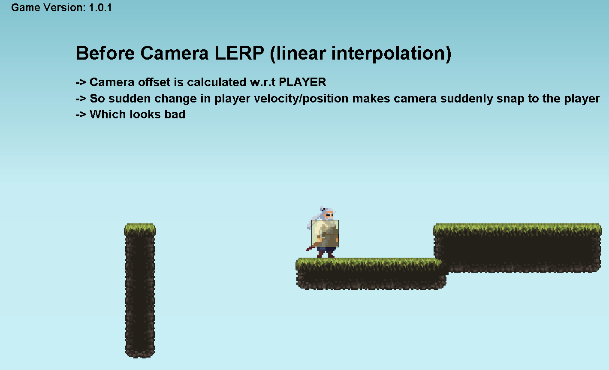
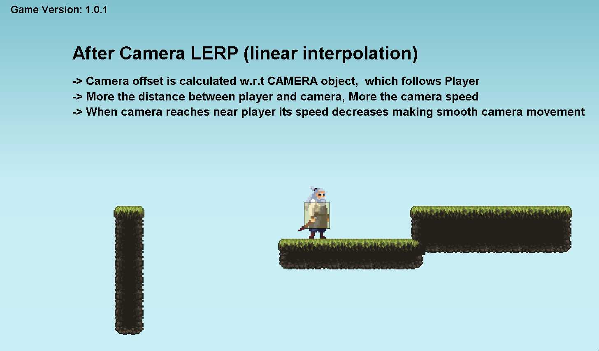
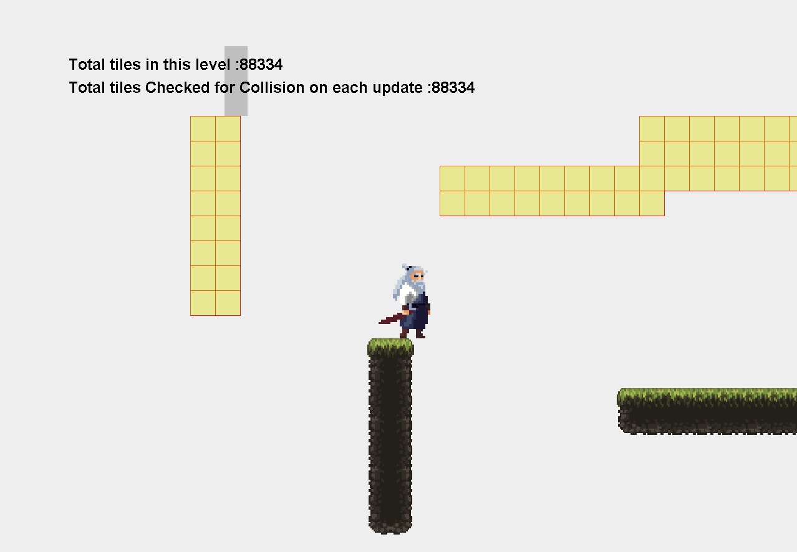
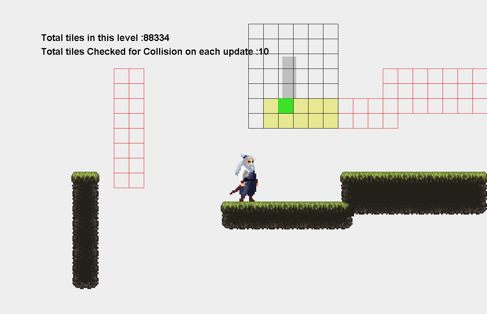
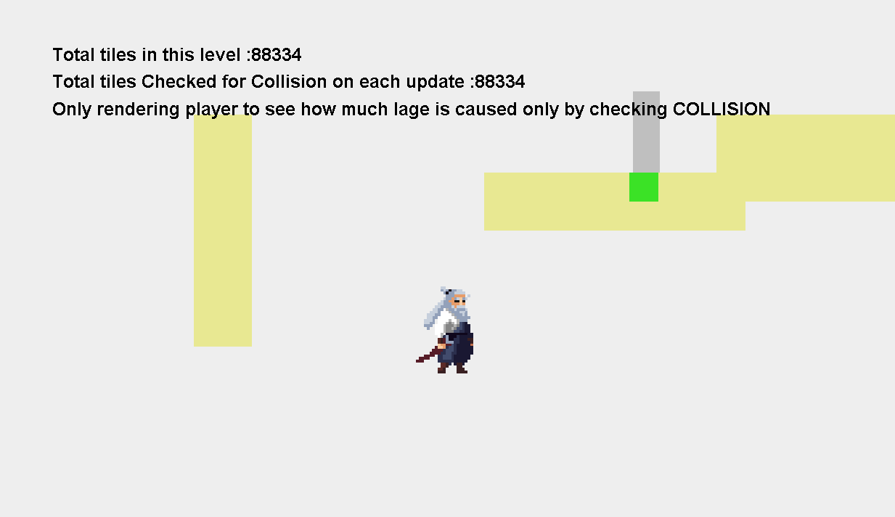
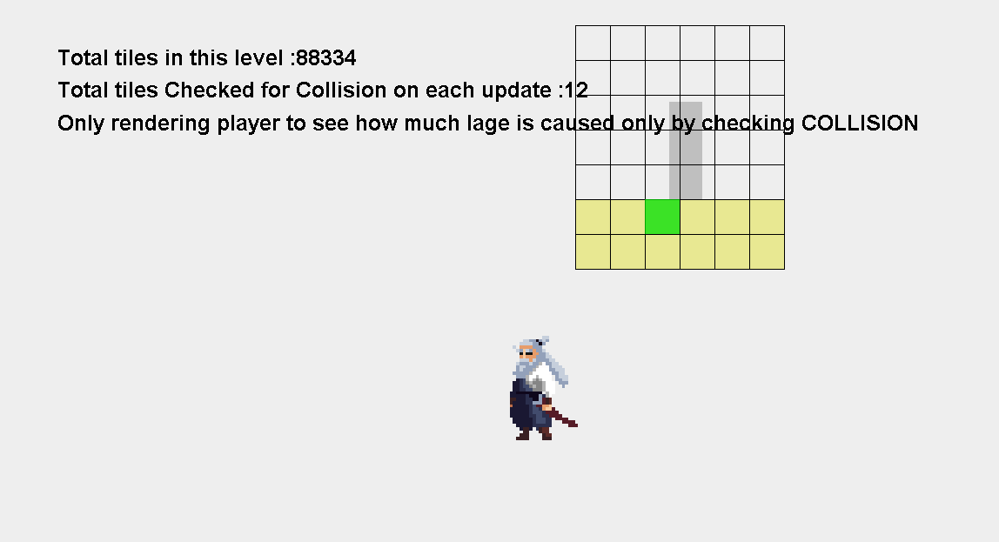
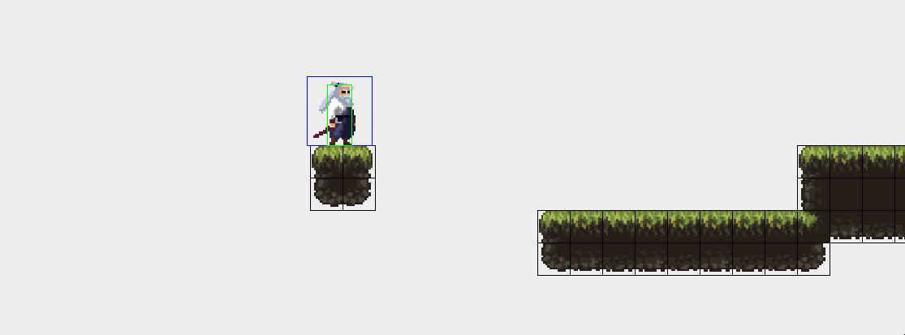
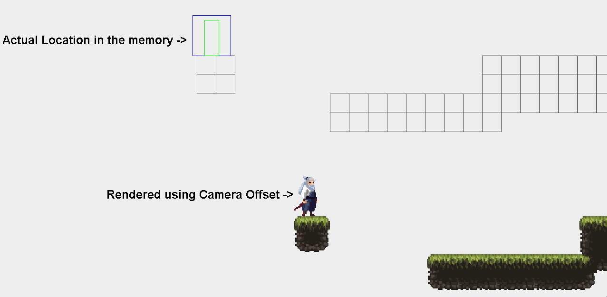

# 📝 Devlog — 2026-01-17 | Game Version 1.0.1

### 📌 Overview
✨ Added camera smoothing (LERP) and a background sky.  
- Fixed sudden teleportation of the camera when climbing walls.

---

### ✨ Features Added
1. 🎯 Created a **Camera** object that follows the player proportionally to the distance between them.  
2. 🖼 Added a **Background** image using the Background class, serving as the base for future background and parallax layers.

---

### 🖼 Visual / Gameplay Changes

**Before:**  
 **⚠️ Weird camera snap**

**After:**  
 **✅ Smooth camera movement**

---

### 👤 Contributors
- @Kapil3772

---

### 🔜 Next Steps
- ☁️ Add clouds in the game with looping functionality.  
- ⚡ Render only the tiles currently visible in the game frame to ensure smooth performance, no matter the total number of tiles.

---

  

# 📝 Devlog — 2026-01-11

### 📌 Overview
Today was focused on **wall interaction mechanics** and **collision checking technique**.  
Most of the work went into

---

### ✨ Features Added
1. Implemented **wall hold, wall slide, wall climb and jump**.
2. Made the game to check only the tiles around the player / entity.
    - Unnecessary collision checking with all the tiles in the map is removed. **THIS DECREASES GAME LOAD.**
4. Introduced a **dynamic physics tile checking area** that scales correctly with entity size.

---

### 🖼 Visual / Gameplay Changes

**Before FIX (checking all tiles in the game):**  
 **⚠️ Extreme Lag**

 

**After FIX (only checking tiles around player):**  
 **⚠️ Slightly reduced lag but still noticeable !!**

---

## 🧠 Technical Learnings
- The lag is not due to the extreme amount of tiles checking math but because of the extreme amount of rendering.

### 🔍 Proof

**BEFORE FIX (Skipping extreme amt of tile rendering):**  

➡️ Very small lag even when checking **80,000 TILES**, **60 times PER SECOND**.

 

**AFTER FIX (Skipping extreme amt of tile rendering):**  

- So the actual problem is rendering.

---

### 👤 Contributors
- @Kapil3772, @you -  LOL WANNA CONTRIBUTE? 😁

---

### 🔜 Next Steps
- Only rendering the tiles that are currently inside the game frame so that no matter the amount of tiles, no serious rendering lag occurs.
- Smooth camera movement (LERP-based follow). (To fix: Sudden teleportation of the camera when climbing the wall).

  

---

---

  

# 📝 Devlog — 2026-01-10

### 📌 Overview
This marks the start of the devlog.  
Here I’ll be documenting progress, changes, and learnings throughout the project — essentially a **visual commit log**.

---

### ✨ Features Added
1. All the features updated befrore making this devlog. lol
2. Introduced Camera so that player is rendered on the center of the screen and everything else is rendered.

---

### 🖼 Visual Changes

**Before (without camera offset):**  

 

**After (with camera offset):**  

---

### 👤 Contributors
- @Kapil3772
